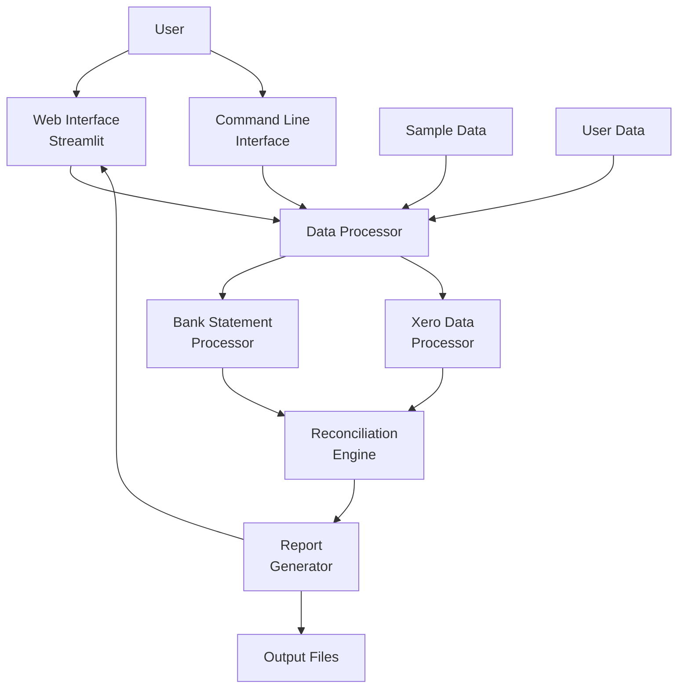
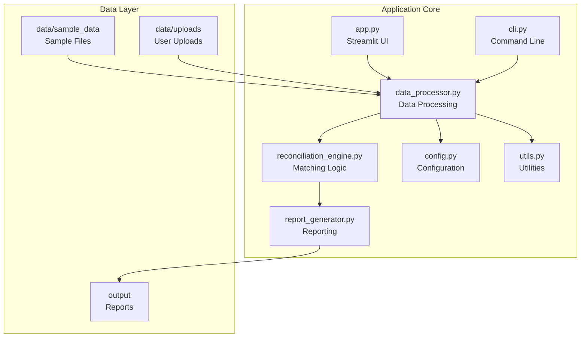
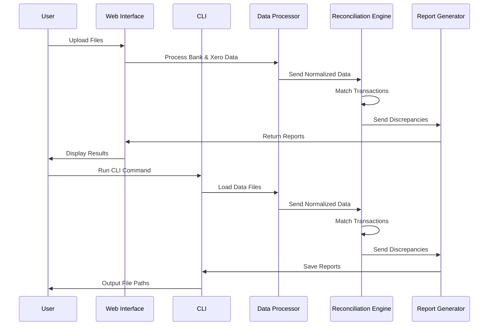
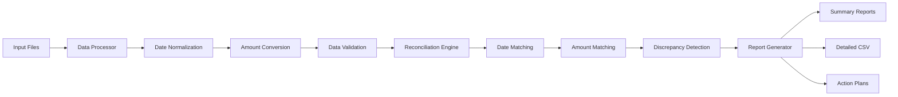

# Kamel Potteries Bank Reconciliation App Architecture

## System Overview

## Component Diagram

## Data Flow

## File Processing Pipeline

## Technology Stack

- **Frontend**: Streamlit (Web Interface)
- **Backend**: Python 3.x
- **Data Processing**: Pandas, NumPy
- **File Handling**: Standard Python libraries
- **Reporting**: Custom report generation
- **Deployment**: Local installation

## Key Features

1. **Dual Interface**: Web UI and Command Line
2. **Flexible Data Processing**: Handles multiple CSV formats
3. **Configurable Matching**: Adjustable tolerance settings
4. **Comprehensive Reporting**: Multiple output formats
5. **Error Handling**: Robust error management
6. **Cross-Platform**: Works on Windows, macOS, and Linux

## Security Considerations

- All data processing happens locally
- No data is transmitted to external servers
- Files are processed in memory
- Temporary files are cleaned up automatically